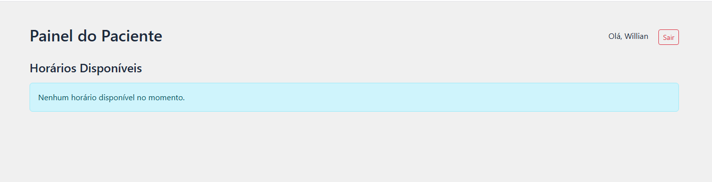
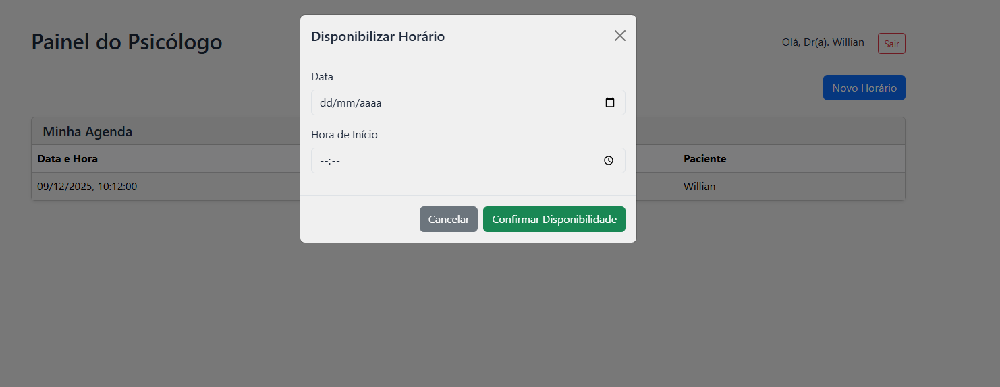
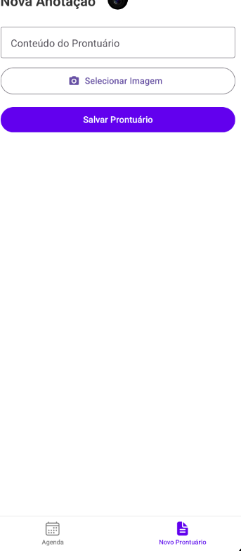

# 🧠 MindCare - Plataforma de Telemedicina Psicológica

MindCare é uma solução completa (Full Stack) para conectar psicólogos e pacientes, permitindo agendamento de consultas, gestão de prontuários e comunicação segura. O projeto é estruturado em uma arquitetura moderna de microsserviços no backend, com interfaces web e mobile robustas.

---

## Pré-visualização da aplicação
### Web
<p align="center">
  
</p>

<p align="center">
  
  
</p>


### Mobile
<p align="center">
  
  
</p>


## 🚀 Tecnologias utilizadas    

### Backend (Microsserviços)
*   **Framework:** .NET 8.0 (C#)
*   **Banco de Dados:** SQL Server (Entity Framework Core)
*   **Autenticação:** ASP.NET Core Identity + JWT (JSON Web Tokens)
*   **Arquitetura:** Microservices (AuthService, SchedulingService, NotesService)
*   **Documentação:** Swagger/OpenAPI

### Frontend (Web)
*   **Framework:** React 19 (Vite)
*   **Linguagem:** TypeScript
*   **Estilização:** Bootstrap 5 + CSS Modules
*   **HTTP Client:** Axios com Interceptors para gestão de tokens
*   **Testes:** Vitest + React Testing Library + Happy DOM
*   **State Management:** Context API (AuthContext)

### Mobile (App)
*   **Framework:** React Native (Expo SDK)
*   **Navegação:** React Navigation (Stack & Bottom Tabs)
*   **UI Library:** React Native Paper
*   **Funcionalidades:** Upload de imagens e Agenda

---

## 📂 Arquitetura do Projeto

O repositório é organizado como um *monorepo* contendo as três camadas principais da aplicação:

```
mindCare/
├── backend/                # Serviços .NET (API)
├── AuthService/        # Gestão de usuários, login e registro
├── NotesService/       # Gestão de prontuários e anotações
└── SchedulingService/    # Gestão de agendamentos
```

---

## ✨ Funcionalidades Principais

### ✅ Autenticação e Segurança
*   Login e Registro separados para **Pacientes** e **Psicólogos**.
*   Validação de CRP para profissionais.
*   Proteção de rotas via JWT no Web e Mobile.

### 📅 Agendamento (Em Desenvolvimento)
*   Psicólogos definem horários disponíveis.
*   Pacientes visualizam e reservam horários.

### 📝 Prontuário Eletrônico (Notes)
*   Psicólogos podem criar anotações sobre sessões.
*   Upload de anexos e imagens (Mobile).

---

## 🛠️ Como Executar o Projeto

### Pré-requisitos
*   Node.js (v18+)
*   .NET SDK 8.0
*   SQL Server (LocalDB ou Container)

### 1. Backend
Navegue para cada pasta de serviço (`AuthService`, `NotesService`, `SchedulingService`) e execute:
```bash
dotnet restore
dotnet ef database update # Criar banco de dados
dotnet run
```
*   AuthService roda na porta: `5107`
*   SchedulingService roda na porta: `5108`
*   NotesService roda na porta: `5109`

### 2. Frontend
```bash
cd frontend
npm install
npm run dev
# Para rodar os testes:
npm test
```

### 3. Mobile
```bash
cd mobile
npm install
npx expo start
```
*   **Atenção:** Em `src/services/apiConfig.js`, configure o IP da sua máquina se estiver testando em dispositivo físico (`DEV_MACHINE_IP`).

---

## 🐳 Como Executar via Docker (Recomendado)

Esta versão conta com suporte a **Conteinerização**, permitindo subir todo o ambiente (Banco de Dados + APIs + Frontend) com um único comando.

### Pré-requisitos
*   [Docker](https://www.docker.com/products/docker-desktop/) e [Docker Compose](https://docs.docker.com/compose/) instalados.

### Passo a passo
1.  **Clone o repositório** (se ainda não o fez).
2.  Na raiz do projeto, execute:
    ```bash
    docker compose up --build
    ```
3.  O Docker irá baixar as imagens, compilar os microsserviços e o frontend, e configurar o banco de dados SQL Server automaticamente.

### Portas e Acessos
*   **Frontend Web:** `http://localhost:3001`
*   **Auth API:** `http://localhost:5107/swagger`
*   **Scheduling API:** `http://localhost:5108/swagger`
*   **Notes API:** `http://localhost:5109/swagger`
*   **SQL Server:** Porta `1433` (interno ao Docker)

> [!NOTE]
> As migrações do banco de dados são aplicadas automaticamente ao iniciar os containers.

---

## 🧪 Testes Automatizados (Frontend)

O projeto Web possui uma suíte de testes robusta cobrindo:
*   **Login:** Renderização, validação de campos e integração com API mockada.
*   **Registro (Psicólogo):** Fluxos condicionais (campo CRP) e submissão.
*   **Acessibilidade:** Verificação de labels e inputs.

Para executar os testes:
```bash
npm test
```

---
**Desenvolvido por Willian Giacomelli**
